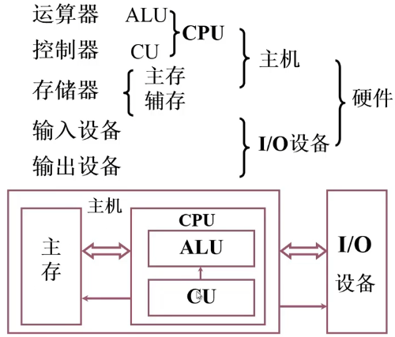
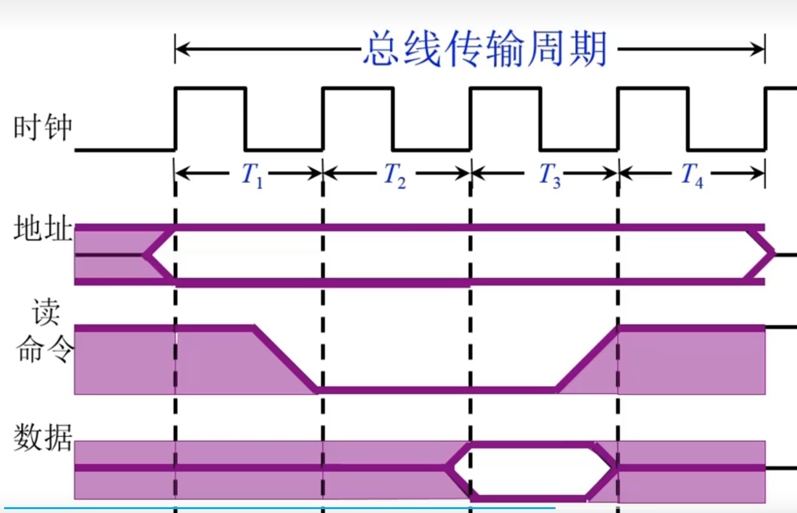
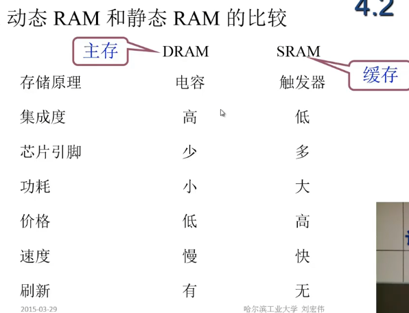
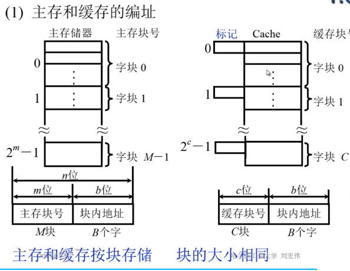
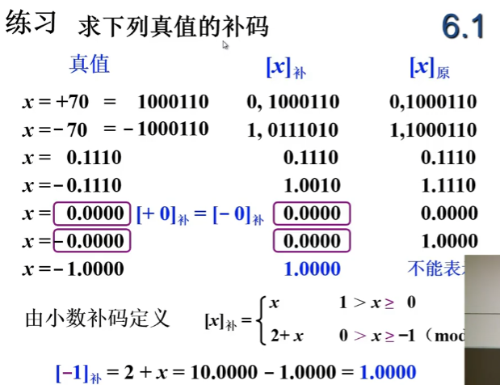

### 第一章计算机系统概论

#### 1.1 计算机系统简介

* 现代计算机的多样性 传感器-手机-电脑- 服务器-HPC , TIANHE2是速度最快的服务器
* 计算机系统由软件和硬件组成
  * 硬件, 是看得见摸得着的事物,为软件提供指令集
  * 软件有系统软件和应用软件,系统软件用来管理计算机系统(如操作系统,语言处理系统,服务型程序,数据库管理系统),应用软件按任务需求编址的程序
* 计算机系统的层次结构
  * 

#### 1.2计算机的基本组成

 ##### 一,冯*诺伊曼计算机的特点

* 计算机由5大部件组成
* 指令和数据以同等地位存贮在存储器中
* 指令和数据用二进制表示
* 指令由操作码和地址码组成
* 以运算器为中心
  * 
* 存储程序(程序存储在存储器中)

##### 二计算机硬件框图

* 以存储器为中心的计算机硬件框图
  * 
  * 

##### 三 计算机的五大部件

###### 1,存储器

* 存储器由若干个存储体和MAR,MDR组成
* 存储体里面有若干个存储单元组成,存储单元有若干个存储元件组成
* MAR名叫存储器地址寄存器,反应存储单元的个数
* MDR存储器数据寄存器,反应存储字长
* 存储单元 存放一串二进制代码
* 存储字 存储单元中二进制代码的组合
* 存储字长存储单元中二进制代码的长度

###### 2,运算器

* 运算器的组成

  * 

    

###### 3,控制器

* 控制器由CU控制单元,IR指令寄存器,PC程序计数器也称指令计数器用来存放将要执行指令的地址
* 
* 取数指令
  * 
  * 存数指令
  * 

#### 1.3计算机硬件的主要技术指标

* 机器字长 CPU一次能处理数据的位数与CPU中寄存器的位数有关
* 运算速度
* 存储容量

* 

* 

### 第二章，系统总线

#### 2.1总线的基本概念

* 为什么要用总线？

  * 采用分散链接，将需要通信的计算机组成部分链接，但是需要占用很多空间和接口

* 总线是链接各个部件的信息传输线是各个部件共享的传输媒介

* 总线上信息的传输分为串行和并行（通常计算机内部）

* 总线结构的计算机框图

  * 

    * 弊端IO读写到主存时，会占用总线，CPU就无法正常工作

  * 

    * 这样也有弊端，I/O写或者读入主存中需要经过cpu，给cpu带来计算负担
  
 * 
  
     
  
    
####  2.2总线的分类

1. 片内总线   芯片内部的总线
2. 系统总线 计算机各个部件之间的信息的传输线
   1. 数据总线  双向 与机器字长，存储字长有关
   2. 地址总线  单向， 与存储地址，IO地址有关
   3. 控制中线 有出 有入
3. 通信总线 用于计算机系统之间的通信

#### 2.3总线的特性以及性能指标

* 总线的特性

1. 机械特性 尺寸，形状，引脚 排列顺序
2. 电气特性 传输方向 和有效的电平范围 
3. 功能特性 地址信号 数据信号 控制信号
4. 时间特性 信号的时许问题

* 总线的性能指标

  * 

  

#### 2.4总线结构

1. 单总线结构
2. 双总线结构
   1. 
3. 三总线结构
   1. 
   2. 
4. 四总线结构
   1. 

* 总线结构举例
  * 
  * 
  * 
  * 

#### 2.5总线控制

###### 2.5.1总线的判优控制

* 主设备（模块） 对总线有控制权， 可以提出总线请求
* 从模块， 不可以提出总线请求，只能响应请求，响应从主设备发来的总线命令。 有些模块既可以是主模块又可以是从模块
* 总线判优控制
  * 
    * 
      * 优点结构简单，缺点对数字电路比较敏感，当BG的线路出现问题时，可能无法授予总线的控制
      * 对总线控制的优先级别时按照BG线路的链路依次降低的
    * 
      * 优先级和计数器有关
    * 

###### 2.5.2总线的通信

* 目的 解决通信双方的==协调配合== 问题
* 总线的传输周期
  * 

* 总线通信的方式
  * 同步通信    ==由统时标控制数据传送==
  * 异步通信   ==采用应答方式，没有公共时钟标准==
  * 半同步通信   ==同步异步结合==
  * 分离式通信   ==充分挖掘系统总线每个瞬间的利用==

###### 同步通信

* 定宽定距的时钟，每个时钟周期都要完成响应的动作

* 

###### 异步通信

*   

###### 半同步通信（同步，异步想结合）

* 

* 

* 

* 以上三种通信的共有特点

  * 主模块，发地址，命令  ==占用总线==
  * 从模块准备数据        ==不占用总线==
  * 从模块向主模块发地址   ==占用总线==
  * 这样对总线来说是浪费

###### 分离式通信

  * 充分挖掘系统总线的每个瞬间的潜能
  * 一个总线的传输周期
      * 

  

*  

### 第三章，存储器 

#### 3.1 概述

##### 3.1.1存储器的分类

1.**按存储介质分类**

* 半导体存储器    ==TTL MOS==    易失
* 磁表面存储器   ==磁头 磁载体== 不易失
* 磁芯存储器                               不易失
* 光盘存储器                         不易失

2.**按存取方式分类**

3.**按在计算机的种类分类**

##### 3.1.2存储器的层次结构

**1.存储器三个主要特性**

* 

#### 3.2主存储器

##### 3.2.1主存储器的基本组成

* 主存的基本组成
  * 
* 主存与cpu的联系
  * 
* 主存中存储单元地址的分配
  * 
* 主存的技术指标
  1. 存储容量
  2. 存储速度
     1. 存取时间      ==存储器的 访问时间， 读出时间，写入时间==
     2. 存取周期     ==连续两次独立的存储操作（读或写）所需的最小间隔时间 读周期，写周期==
  3. 存储器的带宽   ==位/秒==

#####  3.2.2半导体存储芯片简介

**1.半导体芯片的基本结构**

* 
  * 片选线？？？？？

**2，半导体存储芯片的译码驱动方式**

* 线选法
  * 
* 重合法
  * 

##### 3.2.3随机存取存储器（RAM）

1. 静态RAM （SRAM）

   * 

   1. 保存0，1的原理是什么      ==触发器==

   2. 基本电路的构成是什么     

   3. 对单元带电路如何读入和写入     ==T5 T6==   

   4. 典型芯片的结构是什么样子的？

   
* 
* 
* 静态RAM芯片举列
  * 

​      

2. 动态RAM  （DRAM）

* 

* 保存01的原理是什么？  ==电容==

* 基本电路的构成是什么？ 

* 对单元电路如何读入与写入？

* 典型芯片的结构是什么 样子的？

* 动态RAM芯片如何进行读出和写入操作？

* 动态RAM为什么要刷新，刷新方法

  * 动态RAM是利用电容存储电荷的方式来保存信息的，电容非常小，容易漏电，一段时间后我们不对电容当中的信息再生的话电容信息就会丢失，时间长了没有对电容充电的话，之前保存的1，就会变成0

  * 对动态RAM刷新至于行地址有关 ， 一次刷新一行、

  * 刷新方式

    * 集中式刷新

    

    * 分散刷新

    

    * 分散刷新与集中式刷新相结合

* 动态RAM芯片举例

* 

* 

* 

4. 动态RAM和静态RAM的比较
   * 

##### 3.2.4只读存储器（ROM）

1. 掩模ROM（MROM） ==厂家出厂时写好，用户不能改，不能写==

2. PROM（一次性编程）

   1. 

3. EPROM（多次性编程）

   * 

   4. Flash Memory（闪速型存储器）

##### 3.2.5 存储器与CPU的链接

1. 存储器容量的扩展
   1. 位扩展(增加存储字长)
   2. 字扩展（增加存储字的扩展）
   3. 字，位扩展
2. 存储器与CPU的连接
   1. 基本方法
      1. 地址线的连接
      2. 数据线的连接
      3. 读写命令线连接
      4. 片选线连接
      5. 合理选择存储芯片
      6. 其他   如 时序，负载
   2. 答题
      1. 写出对应二级制编码
      2. 确定芯片的数量及类型
      3. 分配地址线
      4. 确定片选信号
      5. 

#### 3.3 存储器的校验

1. 为什么要对存储器的信息进行校验？
   1. 电容的充电放电，或者触发器的反转
2. 为了能够校验出信息是否正确，如何进行编码
3. 纠错检测能力与什么有关
4. 如何进行纠错

* 合法代码集合
  * 
* 编码的最小距离
  * 任意两组合法代码之间二进制位数的最少差异

* 汉明码-----==是具有一位纠错能力的编码==

  * 采用奇偶校验
  * 分组奇偶校验
  * 

  * 如何分组
    * 校验位 1.2.4.8.16.32.64
  * 汉明码的组成
    * 

#### 3.4提高访存速度

#### 3.5习题

	

#### 3.6高速缓重存储器

##### 3.6.1概述

1. 为什么用Cache？
   * 避免cpu空等现象
   * 
2. Cache的工作原理
   1. 主存和缓存的编址
      1. 
   2. 命中与未命中
      * 
   3. Cache的命中率 ==cpu欲访问的信息在Cache中的比例==
      1. 命中率与Cache的容量与块长有关

##### 3.6.2 Cache-主存系统的效率

##### 3.6.3 Cache的基本结构

* 对Cache的读写操作
  * 
  * 

* 对Cache改进
  * 

##### 3.3.4 Cache-主存的地址映射

1. 直接映射
   
   1. 
   
2. 全相连映射

   1. 

3. 组项联映射

   1. 

   

   * 
   
   
   
   

##### 3.3.5替换算法

1. 先进先出（FIFO）算法
2. 近期最少使用（LRU）算法

#### 3.4辅助存储器

### 第四章 输入输出系统

#### 4.1 概述

* IO系统的组成
  * 

#### 4.2 IO设备与主机的联系方式

1. IO设备编址方式
   1. 统一编址   ==IO地址看成内存地址，去存数，就是正常的取存数指令==
   2. 单独编址  ==地址在内存外部，取存数有专门的IO指令==
2. 设备地址 ==用设备选择电路识别是否被选中==
3. 传送方式
   1. 串行
   2. 并行
4. 联络方式
   1. 立即响应
   2. 异步工作采用应答信号
   3. 同步工作采用同步时标
5. IO设备与主机的连接方式
   1. 辐射式连接
   2. 总线连接
      1. 

#### 4.3 IO设备与主机信息传送的控制方式

1. 程序查询方式
   1. 
      * 在数据未准备好之前，cpu还一直询问是否准备好，占用这cpu，会使cpu效率比较低
      * 数据交换内存和IO必须经过CPU。
      * CPU和IO串行工作
2. 程序中断方式
   1. 
   2. 
      * CPU和IO部分的并行工作
3. DMA方式   ==主存和IO有一条直接数据通道==

* ​	

==三种信息传送控制的比较==

#### 4.4 IO设备

1. 人机交互设备               鼠标、键盘、打印机、显示器
2. 计算机信息存储设备      磁盘 、光盘、磁带
3. 机器---机器通信设备     调制解调器
#### 4.5 IO接口

* 总线连接方式的I/O接口电路
* 接口的功能
  1. 选址              ==设备选择电路==
  2. 传送命令      ==命令寄存器，命令译码器==
  3. 传送数据       ==数据缓冲寄存器==
  4. 反应设备状态    ==设置状态标记== 
* ==I/O接口的基本组成==

#### 4.6 程序查询方式

* ==查询流程==
* ==接口电路==

#### 4.7程序中断方式

* 概念，CPU遇到特殊的请求会终端当前运行转去执行特殊请求。

* 程序中断方式的接口电路

  * 1. 配置中断请求触发器和中断请求屏蔽触发器

       1. 

          

    2. 排队器    

       1. 

          

    3. 中断向量地址形成部件

       1. 

    4. 程序中断方式接口电路的基本组成

       1. 

#### 4.8DMA方式

### 第五章、计算机组成原理--数字

* 

#### 5.1无符号数和有符号数

**一、无符号数**

* 寄存器的位数 ==反映无符号数的表示范围   8位 0~255  16位 0~65535==

**二、有符号数**

1. ==机器数（保存在计算机中的数）与真值（平时的数）==

**三，原码，反码补码**

1. ==原码 的表示==

   1. 
   2. 
      * 上述逗号和小数点只是方便人类阅读，计算机存储并不存储
      * 
      * 原码的特点简单，直观，但是做加法时会有问题

   

   

   2. ==补码的表示==

      1. 

      2. 补码定义

         1. ​	

         2. 

            

         3. * 结论

              * ==一个负数加上“模”即可得改负数得补数，得到的补数是个正数==有疑问

              * ==一个正数和一个负数互为补数时，他们得绝对值之和即为模数==	

              * ==正数的补数是其本身==

              * ==负数的补码，符号位不变，其他取反+1==

              * ==当真值为负数时，补码-1，符号位不变，其他位取反得原码==

              * 

              * 

              * 

3. ==反码==

   1. 

4. ==三种机器数小结==

5. * ​	==已知某个数的补码，求其负数的补码，符号位取反，每位取反，最后加1==	

   

   

   6. 移码表示法 ==译码和补码只有符号位不一样==
      1. 

#### 5.2数的定点表示和浮点表示

##### 5.2.1数的定点表示

* 小数点按约定方式标出

  * 

  

##### 5.2.2数的浮点表示

* 
* ==浮点表示==

   

#### 5.3定点运算

##### 5.3.1 ==移位运算==

##### 5.3.2==加减法运算== 

##### 5.3.3 溢出判断

#### 5.4浮点运算

#### 5.5浮点四则运算

#### 5.6算数逻辑单元

### 第六章机器指令

* 指令系统在计算机中的地位 
  * 

#### 6.1机器指令

* 指令的格式是什么	==操作码 地址码 寻址方式==
* 指令的字长    

#### 6.2操作数类型和操作类型

#### 6.3寻址方式

* 寻址方式 ==确定本条指令的操作数地址和下一条要执行指令的指令地址==
* 

**一、指令寻址**

* 顺序寻址  (PC) +1 -> PC
* 跳跃寻址  由转移指令指出

**二、数据寻址**

* 立即寻址   ==形式地址就是操作数，由于形式地址就是操作数，所以不需要再次访问内存==
* 直接寻址   ==有效地址等于形式地址==
* 隐含寻址 ==操作数地址隐含在操作码中==
* 间接寻址 

#### 6.4指令格式举例

#### 6.5RISC技术

​	